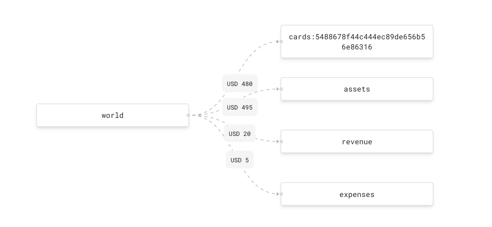
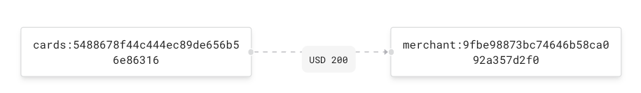
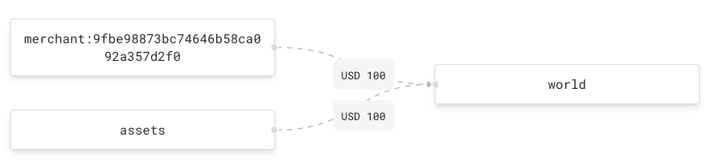

# Magic Ledger

This app is built using a Go server and React JS client. 

## Running the app

I've redacted the formance url and secret (should be stored in a git ignore / secrets file / env) 
from the code so this will need to be replaced in `ledger/ledger.go` (`formanceUrl` and `formanceSecret`, respectively).

cd into the frontend directory. `npm run server` will start the server on port 8080 and `npm start` will 
start the client on port 3000. Navigate to [http://localhost:3000](http://localhost:3000) in your browser to view the app.

## Model

The data is backed by a single formance ledger named `gift-card-ledger`. The ledger is composed of accounts (asset, liability, expense, and revenue)
and transactions which are created between 2 or more ledger accounts.

### Account

Each account has a unique ID, balance(s), transaction volume data, and some metadata. 
The metadata varies depending on the type of account. There are broadly 6 different types of accounts:

1. `world`: an account simulating interactions between accounts on the ledger and the outside world (ex. a users bank account). Formance 
provides a `world` account by default, it's the only type of account that can have a negative balance.


2. `assets`: a debit account representing the assets held by the ledger owner on behalf of its users and merchants. attributes include:
   * `balance_type=debit`: the account is debit normal, debit transactions increase its balance and credit transactions decrease its balance
   * `ledgerable_type=internal`: this an internal account, not one created on behalf of some 3rd party.

    
3. `revenue`: a credit account representing revenue generated. it can only be credited.
   * `balance_type=credit`: the account is credit normal
   * `ledgerable_type=internal`: this an internal account, not one created on behalf of some 3rd party

    
4. `expenses`: a debit account representing expenses (ex. CC fees) generated. it can only be debited.
    * `balance_type=debit`: the account is debit normal
    * `ledgerable_type=internal`: this an internal account, not one created on behalf of some 3rd party


5. `merchant`: a credit account representing a merchant, all prefixed with `merchant:`
    * `balance_type=credit`: the account is credit normal
    * `ledgerable_type=external`: this an external account, created on behalf of some 3rd party
    * `name`: the name of the merchant (ex. "Blue Bottle Coffee")


6. `card`: a credit account representing a gift card held on behalf of some user for a merchant, all prefixed with `cards:`
    * `balance_type=credit`: the account is credit normal
    * `ledgerable_type=external`: this an external account, created on behalf of some 3rd party
    * `name`: the name of the user
    * `merchant_id`: the account address of the merchant associated with this card

### Transaction

Every transaction on the ledger has a `transaction_type` associated with it. There are 5 different types of transactions, each with and amount
transacted and some metadata described below.

1. `purchase_card`: a user purchases a gift card from some merchant. the source of the transaction is `world` and the amount is sent to both 
the `assets` account and new address for the card. additionally, any expenses are sent to the `expenses` account and any revenue is sent to the `revenue` account.
    * `transaction_type=purchase_card`
    * `card_id`: the account address of the card making the purchase
    * `merchant_id`: the account address of the merchant for which the user is buying a gift card
    * `name`: the name of the user buying the gift card


2. `spend_card`: a user spends a gift card at a merchant. the source of the transaction is the card address and the destination is the merchant address
    * `transaction_type=spend_card`
    * `card_id`: the address of the gift card account
    * `merchant_id`: the address of the merchant
    * `purchase_id`: a unique ID for the purchase
    * `name`: the name of the person spending the card (same as whoever purchased it)


3. `payout_merchant`: we payout a merchant. the amount paid out is sent from both the merchant address and the assets account to `world`
    * `transaction_type=payout_merchant`
    * `merchant_id`: the id of the merchant being paid


4. `create_merchant`: a NOOP transaction to create a merchant (sends 0 from `world` to a new merchant address). there is not a convenient way to
create an account via the API, this is the workaround 


5. `create_internal_account`: a NOOP transaction to create the internal accounts (assets, revenue, expenses), necessary since there is not 
a convenient way to create an account via the API. This is done once when the ledger is created


## API

The server exposes 7 different API points. 

#### POST /card/purchase
A request by a user to purchase a gift card.

###### request
```
user_name (string): the name of the user

merchant_id (string): the address of the merchant for whom the user is purchasing a gift card

amount (int64): the amount (in USD) purchased by the user

revenue_take (int64): the amount (in USD) that should be revenue

expenses (int64): the amount (in uSD) that is used for expenses (ex. CC fees)
```

###### response
A formance transaction. There's no conversion between the formance transaction model and some
internally designed model, would be good for a production quality app. Looks like the following:
```
type Transaction struct {
	Metadata          map[string]interface{}       `json:"metadata,omitempty"`
	PostCommitVolumes map[string]map[string]Volume `json:"postCommitVolumes,omitempty"`
	Postings          []Posting                    `json:"postings"`
	PreCommitVolumes  map[string]map[string]Volume `json:"preCommitVolumes,omitempty"`
	Reference         *string                      `json:"reference,omitempty"`
	Timestamp         time.Time                    `json:"timestamp"`
	Txid              int64                        `json:"txid"`
}
```

###### example in formance
Purchase card request from a user gift card (`cards:5488678f44c444ec89de656b56e86316`) for some merchant for $500. $20 goes to
`revenue` account, $5 goes to `expenses` account, $480 goes to the card, $495 goes to `assets`. These amounts are 
configurable via the API. 




#### POST /card/spend
A request by a user to spend a gift card.

###### request
```
card_address (string): the address of the card

amount (int64): the amount to spend
```

###### response
A formance transaction (same as `/card/purchase`). 

###### example in formance
A user spends $200 of their card (`cards:5488678f44c444ec89de656b56e86316`) which is sent to a merchant account with
address `merchant:9fbe98873bc74646b58ca092a357d2f0`



#### POST /merchant/create
Creates a new merchant.

###### request
```
merchant_name (string): the name of the merchant
```

###### response
Just a status code.

#### POST /merchant/payout
A request to payout a merchant.

###### request
```
merchant_id (string): the id of the merchant who should be paid

amount (int64): the amount to payout
```

###### response
A formance transaction (same as `/card/purchase`).

###### example in formance
A merchant is paid out $200. We send $200 frm both the merchant account and the `assets` to `world`.




#### GET /accounts
Retrieves an array of all accounts in the ledger.

###### response
```
address (string): the address of the account

name (string): the name of the account owner (user, merchant)

merchant_id (string): the ID of the merchant the card is associated with (only relevant gift cards)

balance (int64): the balance of the account

balance_type (string): credit or debit

ledgerable_type (string): internal or external
```

#### GET /transactions
Retrieves an array of all transactions in the ledger.

###### response
An array of formance transactions (same as `/card/purchase`).

#### GET /ledger
Returns metadata about the ledger.

###### response
```
debits (int64): sum of the balances of all debit accounts on the ledger

credits (int64): sum of the balances of all credit accounts on the ledger

expenses (int64): the balance of the expense account

assets (int64): the balance of the assets account

revenue (int64): the balance of the revenue account (used in conjuction with assets to determine retained earnings)
```

That's all folks!

_Note to reader_: The React code is all crammed into one component and is a mess, I just wanted to quickly produce
something that worked :)